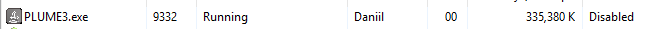

it is the 3rd version of my document editor named 'plume'. 
1st was developed using electron & js
2nd was developed (btw not even finished) using electron and vue.js

this (final) is using java (javafx), material library jfoenix and a default built-in html editor as an editor

EDIT: Yeah, this app is a great RAM consumer

